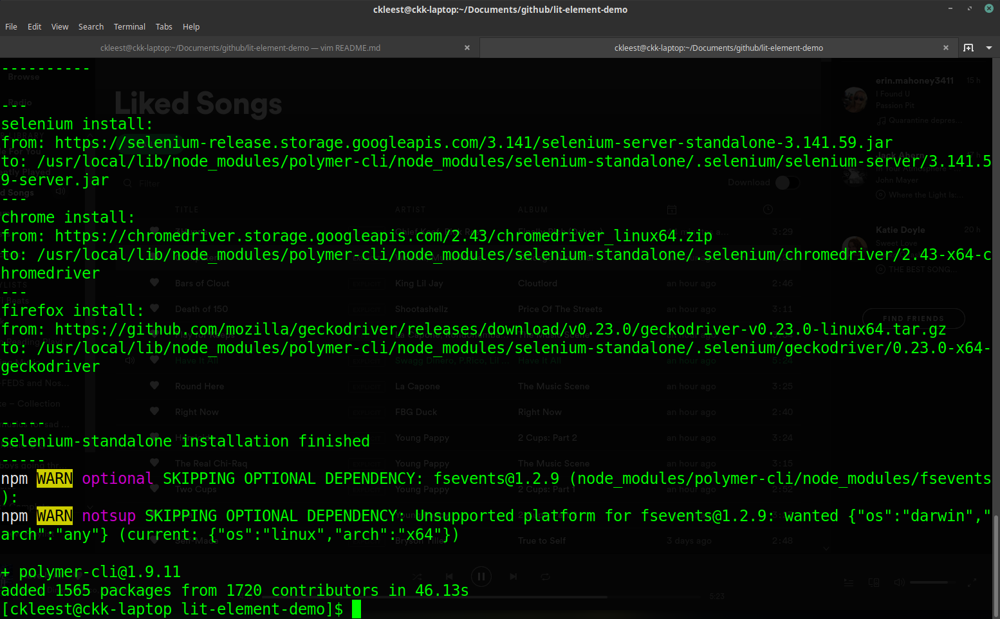

# lit-element-demo

### Installation
Make sure you have npm installed, npm and node.js can be found at [nodejs download]('nodejs.org')
Once installed lets use polymer-cli to help link file paths to node modules.

Make sure you have permissions on the local users node_modules folder, use this command if you do not.
```bash
sudo chown -R $USER /usr/local/lib/node_modules
```
Install polymer-cli
```bash
npm install -g polymer-cli
```

Output should look similar to this.




Now lets install lit-element with npm.
```bash
npm install lit-element
```
You can then use this command to serve you lit-element project locally.
```bash
polymer serve
```

